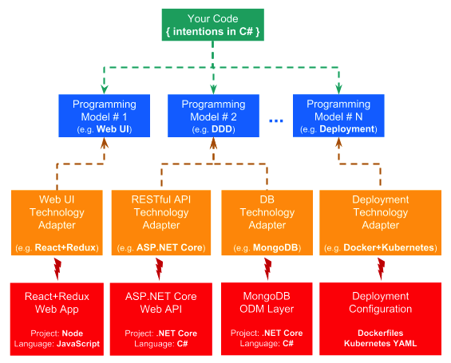

# Intentions-as-code

### Why

We develop applications by translating our intentions (or requirements) into code. Often, a signle intention is projected into many pieces of code across multiple layers, tiers, and services. For example, take a single requirement like "user's email must be unique". Its implementation can be scattered across:

- database scripts
- domain logic
- RESTful API
- UI cues and validations
  - multiplied by the number of UI platforms involved (web/mobile/desktop...)
- IVR (interactive voice response) flows
- tests that cover all of the above

Traditionally, we write and maintain these pieces of code by ourselves. However, they are just mechanical derivatives of our original intentions, and can be produced by some kind of automated mechanism. 

If such mechanism exists, we will only need to code and maintain the intentions, not their implementations. Our codebase will be much smaller. It will be clean from technology details, and express just the distilled concepts of the application. 

### How is it possible?

The mechanism must be able to:

1. understand the intentions
1. provide templated implementations across relevant layers

It's actually simpler than it sounds, at least when enterprise applications are considered. From my experience, commonality in both functional and non-functional requirements here is dramatically higher than variability. Which means, we can create a catalog of common intentions (or requirements), together with their templated implementations. 

#### Programming models

The understanding of the intentions is done through static analysis of the intentions code. To make this task easier, we require the intentions to follow certain conventions. Moreover, we provide special _programming model APIs_, and require the intentions to be coded on top of those APIs (from here on, _programming models_). The programming models provide clear anchors to static analysis logic, thus greatly simplifying it.   

The result of understanding the intentions is represented in the form of data structures, named _metadata_. Each programming model provides its own metadata, which captures the analyzed intentions, together with parameters/configurations of every occurrence. 

#### Technology adapters

A given templated implementation handles intentions captured by a specific programming model. It generates code, which implements the intentions inside specific layers, on top of specific libraries, frameworks, and products. Since technology choices vary widely, there can be multiple alternatives of templated implementations, each targeting a different technology stack. 

Thus basically, each templated implementation _adapts_ some programming model to some specific technology. For this reason, we will refer to templated implementations as _technology adapters_. 

### Example

Suppose we have an enterprise application, which includes the following tiers, and for which we've made the following technology choices:

- Database (MongoDB)
- Business logic (C#)
- RESTful API (ASP.NET Core)
- Web-based UI (React + Redux)
- Containerized deployment (Docker + Kubernetes)
- ... and more

This is how it would be done with _intentions-as-code_ approach:

