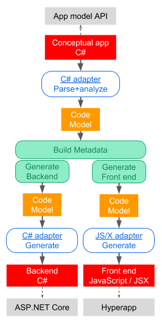

# Proof of concept 

Given intentions-as-code of a simplest web app, generate its 
front-end and backend implementations.

## Modules

Production modules:

- C# language adapter based on Roslyn framework - MetaPrograms.Adapters.Roslyn 
- JavaScript language adapter - MetaPrograms.Adapters.JavaScript 

Proof-of-concept modules:

- Web app expressed through intentions-as-code - Example.App
- Imaginary web UI programming model (example of domain-specific API) - Example.WebUIModel
- Sample backend adapter of web UI programming model to ASP.NET Core - Example.AspNetAdapter
- Sample front-end adapter of web UI programming model to Hyperapp framework - Example.HyperappAdapter

## Web app flow

1. On the web page, user enters her name and clicks "Submit" button. 
1. The page sends AJAX request containing the name, to the server.
1. The server handles the request and responds with greeting text.
1. Web page receives the response and displays the greeting. 

