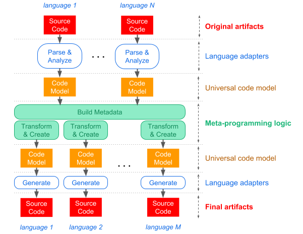

# MetaPrograms

[](https://ci.appveyor.com/project/felix-b/metaprograms)
[](https://ci.appveyor.com/project/felix-b/metaprograms)
[](https://codecov.io/gh/nwheels-io/MetaPrograms)
[](http://www.nuget.org/packages/MetaPrograms/)

This library supports frameworks that implement [_intentions-as-code_ approach](Docs/intentions-as-code.md). You may also find it useful for code generation and analysis tasks, in general.

## Status

In early stages of development. Suitable for playing with the concept. Everything is subject to change at any moment.  

## Build & Run

Requirements: .NET Core 2.0 SDK

```
$ git clone https://github.com/felix-b/MetaPrograms.git
$ cd Source
$ dotnet build
$ dotnet test IntegrationTests/MetaPrograms.IntegrationTests
```

The library passes POC integration test that demonstrates the main use case. More about [Proof-of-Concept here](Docs/poc.md).

## How it works (current concept)



1. **Original artifacts** contain intentions expressed with minimal amount of concise code. In order to make understanding the intentions a simple task, they should be coded according to a defined convention, or on top of a domain-specific API.

1. **Language adapters** are packages that add capabilities of reading and writing a specific programming language. For instance, they are capable of parsing syntax and analyzing semantics of the code, producing _code model_ (explained next). 

1. **Universal code model** represents semantically bound structure of code. That is, identifiers in code are converted into references to model elements they identify. The code model is language-agnostic; it captures superset of modern programming languages features. 

1. **Meta-programming logic** is at the heart of the story. It is where you program transformations and generation of code models, which are then converted into code in target languages. Usually, you first capture domain-specific metadata out of original models; then based on the metadata, you manipulate and generate new models.

1. Resulting code models represent the final artifacts. Resulting models are either obtained by manipulating other models, or generated from scratch. Each model is created with a specific language in mind, as concrete language adapters only handle subset of the model that is applicable to the language.

1. Concrete language adapters generate code of the final artifacts from the code models in (5), in specific programming languages.

## Code Coverage

- dotnet tool install --global coverlet.console
- coverlet MetaPrograms.Tests/bin/Release/netcoreapp2.0/MetaPrograms.Tests.dll --target "dotnet" --targetargs "test MetaPr
ograms.Tests -c Release --no-build" --format opencover
- dotnet tool install --global dotnet-reportgenerator-globaltool --version 4.0.0-rc11
- reportgenerator -reports:coverage.opencover.xml -targetdir:./coverage
