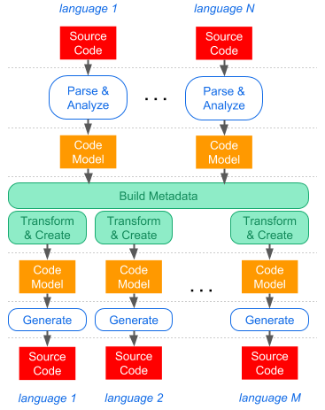

MetaPrograms
=====

[](https://ci.appveyor.com/project/felix-b/metaprograms)
[](https://ci.appveyor.com/project/felix-b/metaprograms)
[](https://codecov.io/gh/nwheels-io/MetaPrograms)
[](http://www.nuget.org/packages/MetaPrograms/)

Enables **easy meta-programming** by providing **static analysis**, transformation, and **code generation** mechanisms in an **extensible** set of **programming languages**.

> **New to meta-programming?** it's a technique in which programs treat other programs as their data. It means, a program can be designed to read other programs, transform them, and generate derived programs automatically. This allows programmers to minimize amount of code to express a solution, reducing the development time. [Read more on Wikipedia](https://en.wikipedia.org/wiki/Metaprogramming).



## Goal

Provide meta-programming infrastructure layer to full-stack _intentions-as-code_ frameworks based on .NET Core.

> **Intentions-as-code** is an approach, which applies meta-programming to full-stack development of SaaS and enterprise applications. It aims to let developers express the entire application, including non-functionals, with minimal amount of code on conceptual level (abstracted from concrete technology); then impelmentation details are generated per selected technology stacks. [Read more here](Docs/intentions-as-code.md).

## Status

> WARNING: In early stages of development. Good for experimenting with the concept,  but not for production. No backward compatibility is matintained at this time. 

## Demo


Requirements: [.NET Core 2.1 SDK](https://www.microsoft.com/net/download/dotnet-core/2.1) (runs on Linux, macOS, and Windows)

### What's in the demo

- Sample programming model of single-page web apps 
- Sample technology adapter that generates JavaScript web app based on the Hyperapp framework 
- Sample technology adapter that generates C# backend service based on ASP.NET Core.
- Intentions-of-code (in C#) of a sample web app, including simple backend logic 

For more details, read about [proof-of-conept integration test](Docs/poc.md).

### How to rum

```
$ git clone https://github.com/nwheels-io/MetaPrograms.git
$ cd MetaPrograms/Source/Demo
$ dotnet build
$ dotnet run
```

### Results

Once the run completes, the results will be in the DemoResults folder:

```
$ ls -l DemoResults/FrontEnd
$ ls -l DemoResults/BackEnd
```


## Languages and platforms

**MetaPrograms** is developed in C# for .NET Core, and runs on Linux, macOS, and Windows. 

The set of languages supported by the framework is extensible. Moreover, there is absolutely no limit on platforms, frameworks, and products that can be targeted by the generated code.

In order to analyze and generate code in specific languages, corresponding language-specific packages must be used in addition to the base **MetaPrograms** package. 

The following language-specific packages currently exist:

Language|Package|Analysis|Generation|Remarks
---|---|---|---|---
C#|[MetaPrograms.CSharp](Source/MetaPrograms.CSharp)|V|V|based on [Roslyn](https://github.com/dotnet/roslyn)
JavaScript|[MetaPrograms.JavaScript](Source/MetaPrograms.JavaScript)|X|V|ES6 + JSX

The list will eventually include dozens of languages. Note that not every package supports both analysis and generation.

The library passes POC integration test that demonstrates the main use case. [Read details here](Docs/poc.md).

## Contribute

```
$ git clone https://github.com/nwheels-io/MetaPrograms.git
$ cd Source
$ dotnet build
$ dotnet test IntegrationTests/MetaPrograms.IntegrationTests
```


## Status

The project is currently in early stage of development. You can play with the concept, but do not use it for production. Everything is subject to change, and no backward compatibility is maintained at this stage.  

## Build & Run

Requirements: [.NET Core 2.1 SDK](https://www.microsoft.com/net/download/dotnet-core/2.1) (runs on Linux, macOS, and Windows)

```
$ git clone https://github.com/nwheels-io/MetaPrograms.git
$ cd Source
$ dotnet build
$ dotnet test IntegrationTests/MetaPrograms.IntegrationTests
```
